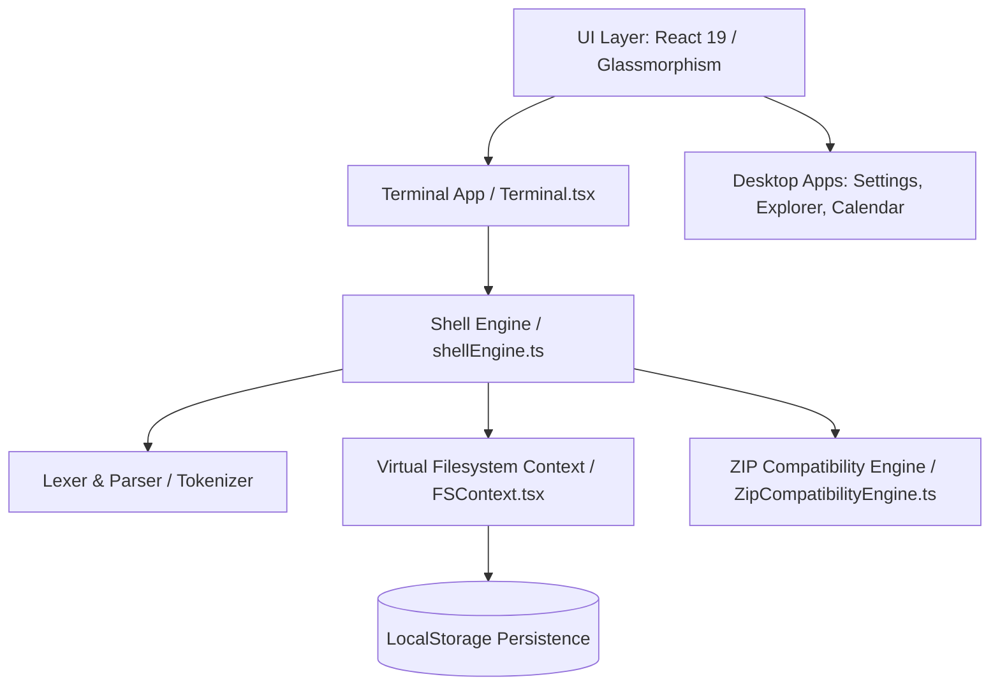

# ARESOS System Architecture

This document outlines the software architecture of ARESOS v2.0.

## Layered System Overview

### 1. UI Layer
- Built with **React 19** and **Tailwind CSS**.
- Leverages a custom glassmorphism theme and animations for desktop window managers, centering docks, minimize operations, and z-index window ordering.

### 2. Terminal Layer (`Terminal.tsx`)
- Handles browser input key bindings (including history scrolling via arrow keys), text selection, simulated prompt interfaces, and ANSI styling.

### 3. Shell Engine (`shellEngine.ts`)
- Interprets user commands.
- Implements environment variables (`export`, `unset`), aliases (`alias`, `unalias`), and command histories.
- Triggers async commands (`ping`, `weather`) and routes simulated outputs.

### 4. Parser & Tokenizer
- Parses command lines into token lists.
- Supports chaining operators (`&&`, `||`, `;`), pipes (`|`), subshell grouping (`( )`), and output redirection (`>`, `>>`, `<`).

### 5. Virtual Filesystem (VFS) (`FSContext.tsx`)
- A hierarchical directory tree mapped in React context and backed by `localStorage` persistence.
- Models files (`FSFile`) and directories (`FSDirectory`).
- Offers native read/write, deletion, renaming, directory listings, and path resolution APIs.
- Supports preserving raw binary `Uint8Array` data on file nodes.

### 6. ZIP Compatibility Engine (`ZipCompatibilityEngine.ts`)
- Scans files for standard PKZIP magic headers (`50 4B 03 04`) or native ARESOS JSON signatures.
- Parses standard ZIP file structures (Local File Headers) sequentially.
- Integrates `DecompressionStream` (with Node `zlib` fallback) to extract stored (method 0) and deflated (method 8) binary payloads directly back into the VFS.
