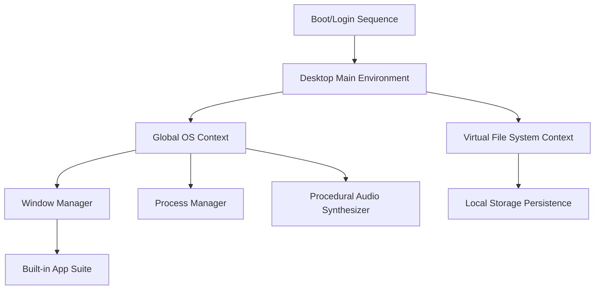
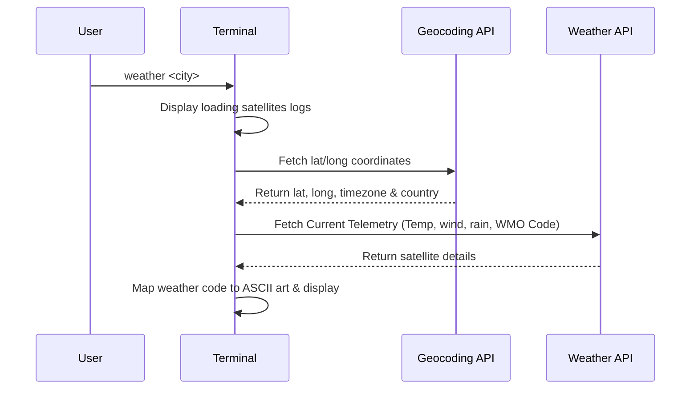

# 🌌 ARESOS Documentation & Architecture Specification

Welcome to the official technical documentation of **ARESOS**, a high-fidelity, client-side, web-based operating system designed for student mission control dashboards. This document outlines the application architecture, data flow, component registry, and customization models.

---

## 🏛️ Architecture Overview

ARESOS is built entirely as a single-page application (SPA) on top of the **Next.js 16 (App Router)** and **React 19** frameworks. The system uses a modular micro-kernel approach where the OS state, file system state, and audio synthesis engine run independently as contexts and hooks.



### Key Pillars of the OS:
1. **State Isolation**: The OS state ([OSContext.tsx](file:///c:/Users/Ankit/Desktop/ARESOS/frontend/context/webos/OSContext.tsx)) manages windows, focus states, settings, and notifications without interfering with the data directory layers.
2. **Deterministic VFS**: The filesystem ([FSContext.tsx](file:///c:/Users/Ankit/Desktop/ARESOS/frontend/context/webos/FSContext.tsx)) operates on a synchronized tree structure, persisting changes immediately to the user's browser storage.
3. **Procedural Chimes**: The audio engine ([audio.ts](file:///c:/Users/Ankit/Desktop/ARESOS/frontend/utils/webos/audio.ts)) generates system alerts, startup chimes, and interactive feedback frequencies dynamically using Web Audio API nodes.

---

## 📂 Core Directory Tree

```text
ARESOS/
├── frontend/
│   ├── app/                # App router entry pages and layout configurations
│   ├── components/         # Interactive UI containers and functional apps
│   │   └── webos/
│   │       ├── apps/       # Native apps (Terminal, TextEditor, Settings, etc.)
│   │       └── core/       # Shell layouts (MenuBar, Dock, Window containers)
│   ├── config/             # Declarative app manifests and theme parameters
│   ├── context/            # Global React state providers (OS and VFS)
│   ├── hooks/              # Custom context wrapper hooks (useOS, useFileSystem)
│   ├── public/             # Image backdrops, static assets, and logos
│   ├── types/              # Static TypeScript type schemas and declarations
│   └── utils/              # Client utilities (Web Audio API Synthesizers)
└── README.md               # Quickstart and introductory guidelines
```

---

## 💾 Virtual File System (VFS)

The Virtual File System is implemented inside [FSContext.tsx](file:///c:/Users/Ankit/Desktop/ARESOS/frontend/context/webos/FSContext.tsx). It mimics a classic Unix directory layout starting from a root node `/`.

### Directory Layout Initializer:
```json
{
  "/": {
    "home": {
      "user": {
        "Desktop": {
          "Welcome.txt": "Welcome text details...",
          "README.md": "VFS specification markdown..."
        },
        "Documents": {
          "project_ideas.txt": "Idea list..."
        },
        "Downloads": {}
      }
    },
    "bin": {}
  }
}
```

### VFS Interfaces & API Calls:
The file system can be operated by importing the `useFileSystem` hook:

```typescript
import { useFileSystem } from "@/hooks/webos/useFileSystem";

const { 
  root, 
  currentPath, 
  listDirectory, 
  readFile, 
  writeFile, 
  createDirectory, 
  deleteNode, 
  changeDirectory 
} = useFileSystem();
```

*   `listDirectory(path?: string)`: Returns child nodes array of `{ name: string, node: FSNode }`.
*   `readFile(filePath: string)`: Retrieves the contents and size of a file, returning `FSFile` or `null`.
*   `writeFile(filePath: string, content: string)`: Overwrites or creates a file with the payload and recalculates sizes.
*   `changeDirectory(targetPath: string)`: Implements standard Unix navigation (`..` or absolute paths) to mutate current path.

---

## 🪟 Window & Process Management

All active desktop windows are processes registered in the [OSContext.tsx](file:///c:/Users/Ankit/Desktop/ARESOS/frontend/context/webos/OSContext.tsx).

### Data Interfaces:

```typescript
export interface Process {
  pid: string;          // Globally unique process ID (e.g. terminal-171800)
  appId: string;        // ID reference in apps.config
  title: string;        // Rendered name in taskbar
  state: "running" | "suspended";
}

export interface WindowInstance {
  id: string;           // Maps to process PID
  pid: string;
  title: string;
  x: number;            // Current left coordinate
  y: number;            // Current top coordinate
  width: number;
  height: number;
  isMinimized: boolean;
  isMaximized: boolean;
  isFocused: boolean;
  zIndex: number;
}
```

### Window Stacking (Z-Index Escalation):
To bring a window to the front without refreshing elements:
1. The system monitors a central `maxZIndex` state.
2. Clicking or focusing a window increments `maxZIndex` and assigns this new value to that window's `zIndex` parameter.

---

## 🎹 Synthesizer Soundscapes (Web Audio API)

All system sounds in ARESOS are generated procedurally on-the-fly inside [audio.ts](file:///c:/Users/Ankit/Desktop/ARESOS/frontend/utils/webos/audio.ts) without fetching audio assets.

### Startup Chime Implementation:
```typescript
export function playBootSound(volume: number = 0.8) {
  const ctx = getAudioContext();
  if (!ctx) return;

  const now = ctx.currentTime;
  const masterGain = ctx.createGain();
  masterGain.gain.setValueAtTime(volume, now);
  masterGain.connect(ctx.destination);

  // E-Major Chord Synthesizer frequencies
  const freqs = [164.81, 329.63, 493.88, 659.25]; // E3, E4, B4, E5

  freqs.forEach((f, i) => {
    const osc = ctx.createOscillator();
    const gainNode = ctx.createGain();

    osc.type = "sawtooth";
    osc.frequency.setValueAtTime(f, now);

    // Apply lowpass filters to smooth out sawtooth buzzing
    const filter = ctx.createBiquadFilter();
    filter.type = "lowpass";
    filter.frequency.setValueAtTime(100, now);
    filter.frequency.exponentialRampToValueAtTime(1200, now + 1.5);

    gainNode.gain.setValueAtTime(0, now);
    gainNode.gain.linearRampToValueAtTime(0.25, now + 0.1);
    gainNode.gain.exponentialRampToValueAtTime(0.0001, now + 2.5);

    osc.connect(filter);
    filter.connect(gainNode);
    gainNode.connect(masterGain);

    osc.start(now);
    osc.stop(now + 3.0);
  });
}
```

---

## 🛠️ App Integration Guide (Adding custom Apps)

Adding a new application to ARESOS is declarative and requires three steps:

### 1. Register the application in App Config:
Open `frontend/config/webos/apps.config.ts` and add your application schema:

```typescript
export const APP_REGISTRY = {
  // Add yours:
  "mynewapp": {
    id: "mynewapp",
    title: "My New App",
    icon: "🚀",
    defaultWidth: 650,
    defaultHeight: 450,
    isSingleInstance: true,
  }
};
```

### 2. Map the ID to a JSX component:
Add your component to the application controller mapping inside [Desktop.tsx](file:///c:/Users/Ankit/Desktop/ARESOS/frontend/components/webos/core/Desktop.tsx):

```tsx
import MyNewApp from "@/components/webos/apps/MyNewApp";

const renderAppContent = (appId: string, pid: string) => {
  switch (appId) {
    case "mynewapp":
      return <MyNewApp pid={pid} />;
    // Other cases...
  }
};
```

### 3. Create your app component file:
Create `MyNewApp.tsx` inside `frontend/components/webos/apps/`:

```tsx
"use client";

import React from "react";
import { useOS } from "@/hooks/webos/useOS";

export default function MyNewApp({ pid }: { pid: string }) {
  const { addNotification } = useOS();

  return (
    <div className="p-4 bg-zinc-900 text-white h-full w-full">
      <h2>Hello Space!</h2>
      <button 
        onClick={() => addNotification("New App", "Hello from your custom app!", "info")}
        className="px-4 py-2 bg-indigo-600 rounded"
      >
        Trigger Notification
      </button>
    </div>
  );
}
```

---

## 🌐 Satellite Weather System (Terminal Interface)

The Terminal weather feature retrieves global meteorological datasets by communicating with public satellite endpoints asynchronously.



### Error Mitigation on Enclosures:
Brackets, braces, parentheses, or quotes often copied from templates (e.g. `weather <jaipur>`) are stripped automatically using regex replacements:
```typescript
queryCity = queryCity.trim().replace(/^<|>$/g, "").replace(/^\[|\]$/g, "").replace(/^\(|\)$/g, "").replace(/^"|"$/g, "").replace(/^'|'$/g, "").trim();
```

---

## 🚀 Deployment Specifications

To prepare ARESOS for a production release:

1. **Verify build consistency:**
   ```bash
   npm run build
   ```
2. **Deploy on host environments (e.g., Vercel / Netlify / Cloudflare Pages):**
   *   Build Command: `npm run build`
   *   Output Directory: `.next` or standard static exports if configured.
   *   Node Version: `>= 18.17.0`
