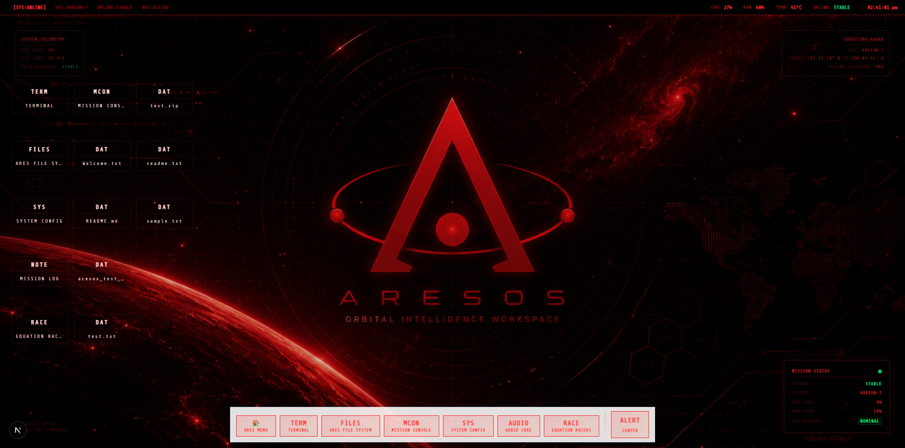
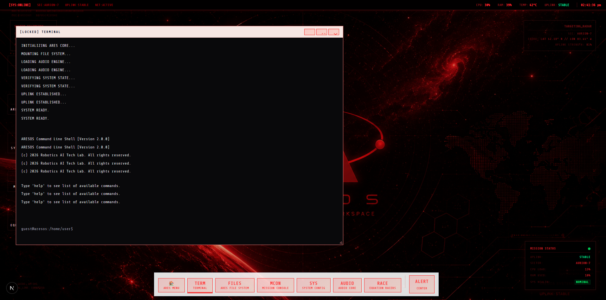
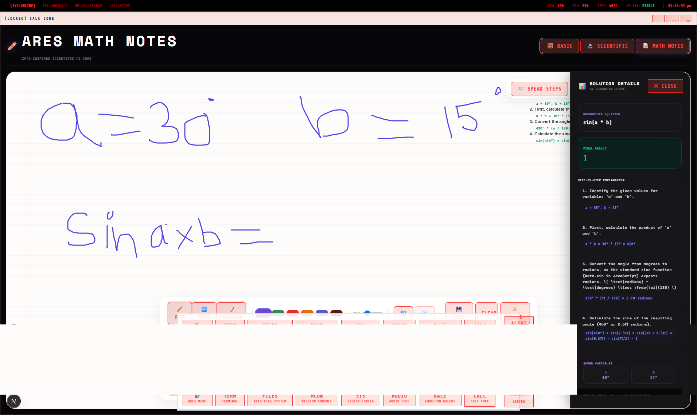
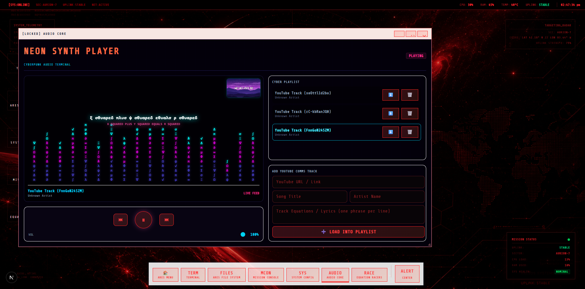
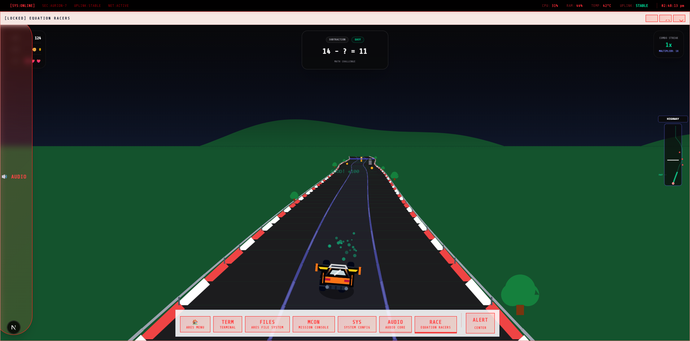

# ARESOS

A browser-based WebOS with a red-themed desktop environment.

ARESOS is an experiment to see how much of an operating system experience can be recreated inside a browser and what that experience feels like.



## Live Demo

**Try ARESOS:** https://aresos-red.vercel.app/

---

## Why I Built It

I wanted to make something more than a desktop with a wallpaper.

I wanted users to actually interact with applications, files, games, and tools inside the browser instead of just looking at a static UI.

I wanted to understand how complex software systems work:

- How applications communicate with each other
- How files are managed
- How state is stored
- How different parts of a system work together

I also wanted to learn something new by building a larger project instead of following tutorials.

I used AI as a tool during development, but building the project, solving problems, making decisions, debugging issues, and learning from mistakes was still part of the process.

---

## Features

- Desktop-style workspace
- Multi-window application system
- Custom terminal
- Virtual file system
- Math Notes application
- Music player with playlist storage and audio visualization
- Equation Racers game
- Neon Duel game
- Persistent browser storage
- Custom red-themed interface
- Responsive desktop, tablet, and mobile support

---

## Screenshots


### Terminal



### Math Notes




### Music Player



### Equation Racers



---

## How It Works

### Virtual File System

ARESOS includes a custom virtual file system that stores files and folders directly inside the browser using local storage. Files remain available even after refreshing the page.

### Window System

Applications run inside movable and resizable windows. Window state, size, position, and focus are managed through a centralized system.

### Music Player

The music player supports saved playlists and animated audio visualization.

### Terminal

The terminal uses a custom command engine that can interact with the virtual file system and execute simulated shell commands.

---

## Challenges

Some of the biggest challenges during development were:

- Building a virtual file system
- Managing application state across multiple windows
- Creating games without external assets
- Designing a UI that feels like a desktop environment
- Making the project work across different screen sizes
- Keeping the system stable while adding new features
- Fixing regressions caused during development

Another challenge was working with AI tools.

Sometimes AI would get stuck in loops, introduce bugs, or break working features. I had to learn when to trust suggestions and when to debug problems myself.

---

## What I Learned

- State management
- Browser storage
- Window management
- Game development
- Working with AI tools
- Debugging large codebases
- Project architecture

---

## Current Status

ARESOS is an experimental project and is still under active development.

Some applications are complete, while others are still being improved. The terminal currently supports many commands, but some behavior is simulated and not yet fully implemented.

---

## Future Plans

ARESOS is still an ongoing project and there are many things I want to improve in the future.

- Move parts of ARESOS to a cloud-based architecture
- Reduce browser limitations where possible
- Add AI-powered features and assistants
- Support more applications and tools
- Improve the terminal and virtual file system
- Better mobile and cross-device support
- Expand the overall ARESOS ecosystem

---

## Tech Stack

### Frontend

- Next.js
- React
- TypeScript
- Tailwind CSS

### Browser APIs

- LocalStorage
- Canvas API
- Web Audio API

---

## Running Locally

```bash
git clone <repository-url>

cd frontend

npm install

npm run dev
