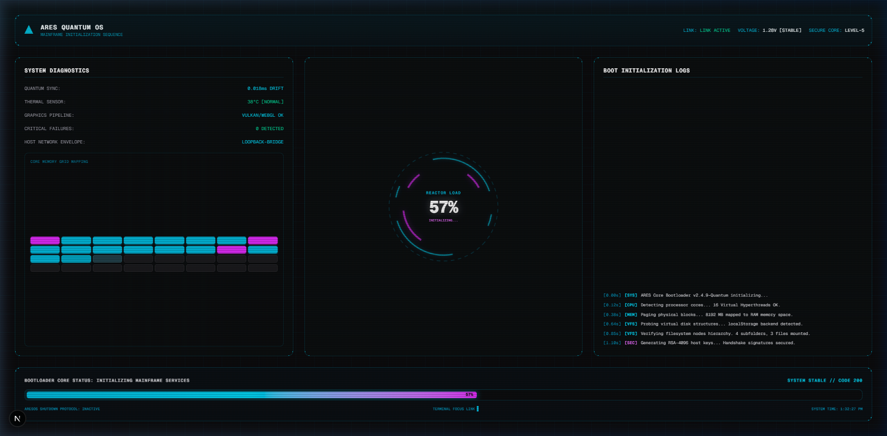
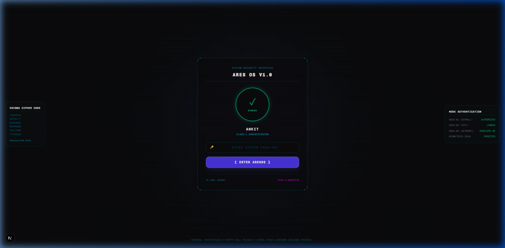
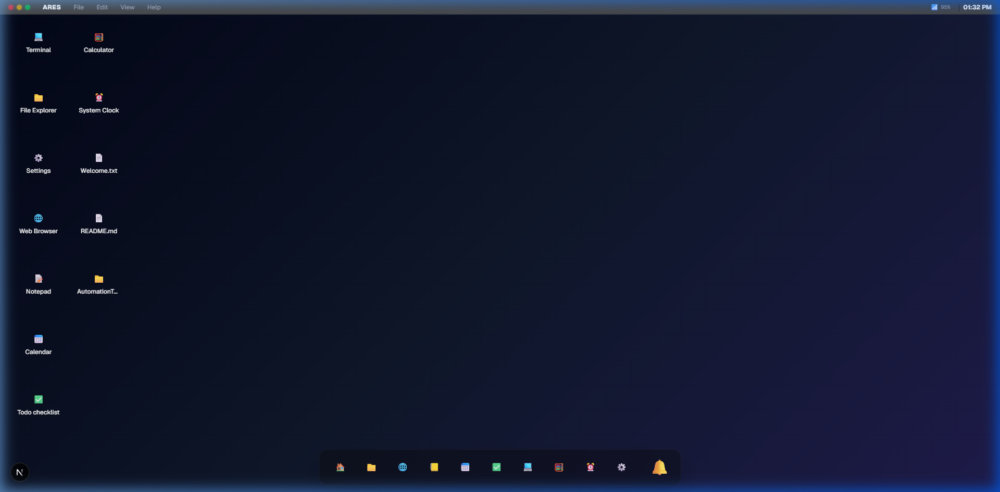
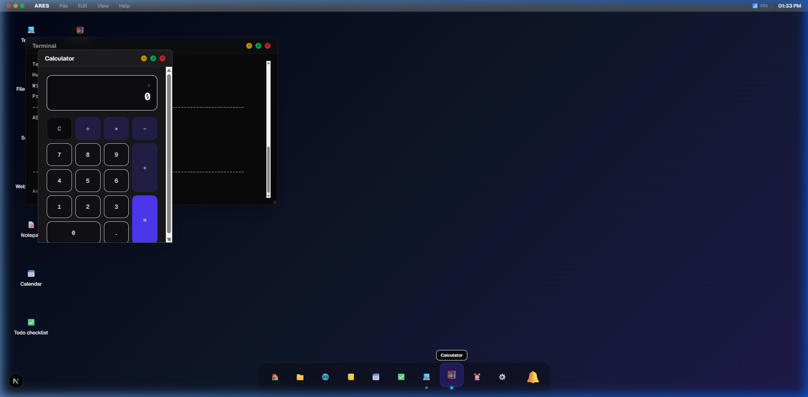

# ARESOS 🌌 — Advanced Sci-Fi Web Operating System

[](https://nextjs.org/)
[](https://react.dev/)
[](https://www.typescriptlang.org/)
[](https://tailwindcss.com/)
[](DOCUMENTATION.md)

ARESOS (ARES Operating System) is a premium, highly interactive, and visually stunning web-based operating system designed for student mission control. It features immersive animations, browser-synthesized soundscapes, an active virtual filesystem, and a full suite of productive desktop utility applications.

> [!NOTE]
> For a comprehensive system layout, custom app integration guide, virtual filesystem specification, and procedural audio setups, check out the [ARESOS System & Architecture Documentation](DOCUMENTATION.md).

> [!TIP]
> Visit the project locally to experience the custom Web Audio API chimes and desktop window transitions in real-time.

---


Some developer and networking commands currently operate in simulation mode and are planned for future runtime-backed implementations.

## Default Login Credentials

The default account is available for initial setup and evaluation purposes.

| Field    | Value     |
| -------- | --------- |
| Password | `1462007` |

> **Note:** These credentials are intended for development and demonstration use only. Change the default password or remove the account before using ARESOS in a production environment.


## 📸 Interface Screenshots

### 1. Mainframe Initialization Boot Screen
<p align="center">
  
</p>

### 2. Biometric Retinal Scanner Login
<p align="center">
  
</p>

### 3. Desktop Environment Workspace
<p align="center">
  
</p>

### 4. Multi-App Workflow (Terminal with neofetch & weather, Calculator)
<p align="center">
  
</p>

---

## 🔮 Key Features

### 1. Immersive Sci-Fi Entryway
*   **Mainframe Initialization Boot Screen:** Features a rotating SVG reactor core loader displaying progress, diagnostic sensor grids mapping system memory allocation, live system clock trackers, and scrolling logging sequences resolving to a startup chime.
*   **Biometric Retinal Scanner Login:** Interactive radar eye scanner panel with laser scanning lines, auto-scrolling decryption matrices, validation checks that play scan sound effects, and session authorization to the desktop environment.

### 2. Desktop Environment & Navigation
*   **macOS-style Centered Dock:** Centered floating glassmorphic dock supporting magnification on hover, active process status dots, notification counters, and bouncing icon animations on launch.
*   **Slide & Shrink Window Minimize:** Double-clicking title bars or clicking minimize scales windows down and slides them smoothly straight into the Dock area using CSS transforms and transition effects.
*   **Z-Index Window Layering:** Focus system that automatically surfaces the active window layer to the front while maintaining standard coordinates, drag limits, and borders.
*   **High Performance Drag & Resize:** Fluid repositioning and resizing of window containers within desktop boundaries.
*   **Global Status Menu Bar:** macOS-style top bar tracking local connection indicators, clock timers, volume nodes, and system menus.

### 3. Integrated Web Audio API Synthesizer
*   No external asset `.mp3` files needed. All sounds are generated procedurally on-the-fly using browser oscillators, lowpass filters, and exponential frequency ramps:
    *   **Startup Sweep:** Heavy sawtooth lowpass frequency sweep overlaid with an E-major chime triad.
    *   **Scanner Ping:** Fast triangle frequency sweeps simulating biometric eye sonar.
    *   **Granted Chord:** Ascending sine arpeggio resolving to a C-major chord.
    *   **System Click:** Subtle click feedback for buttons.
*   All audio outputs respect the volume level configured in the Notification Center.

### 4. Built-in Applications Catalog

| Application | Description | Features |
| :--- | :--- | :--- |
| **💻 Terminal** | Interactive Command CLI Shell | Blinking cursor `█`, hidden input focus bindings, command history memory logs (ArrowUp/Down), virtual shell command execution (`ls`, `cd`, `cat`, `mkdir`, `rm`, `neofetch`, `theme`, `clear`). |
| **📒 Text Editor** | Custom Notepad application | Document explorer sidebar mapping `/home/user/Documents` (Physics, Maths, Ideas), menus (File, Edit, Format for wrapping & font scaling), cursor coordinates line/column metrics status bar. |
| **📁 File Explorer** | Graphical directory tree explorer | VFS folder/file creation and deletion, list navigation. |
| **⚙️ Settings** | Controls center configuration | Custom tab panels (Appearance themes, Wallpaper gradients, profile editor, storage disk space summary, about stats card). |
| **🔔 Notifications** | Control center drawer | Pomodoro focus session timer, daily target checklist, brightness sliders, and checkmarked OS system alerts list. |
| **⏰ System Clock** | Live timezone clocks & stopwatch | Multi-world time zone trackers, stopwatch with laps logger. |
| **📅 Calendar** | Monthly scheduler | Highlights and lists scheduling slots (including Ankit's birthday!). |
| **✅ Todo App** | Checklist task manager | Add, toggle, and delete custom chore lists. |
| **🧮 Calculator** | Mathematical scratchpad | Responsive arithmetic layout pad supporting basic operations. |
| **🌐 Web Browser** | iframe website bookmark navigator | Load address URL requests with search query fail-safes. |

---

## 🛠️ Tech Stack & Architecture

*   **Framework:** Next.js 16.2.9 (App Router)
*   **Runtime:** React 19.2.4 & TypeScript 5
*   **Styling:** Tailwind CSS v4 & custom glassmorphism styles
*   **Audio Synthesis:** Web Audio API Oscillators, BiquadFilters & GainNodes
*   **Virtual Filesystem (VFS):** Tree-structured node directory map persisted directly to `localStorage`

---

## 🚀 Getting Started

To launch ARESOS on your local system, follow these steps:

### Prerequisites
*   Node.js (v18 or higher recommended)
*   npm (installed with Node.js)

### Installation & Run

1. Clone the repository and navigate into the `frontend` directory:
   ```bash
   cd frontend
   ```
2. Install dependencies:
   ```bash
   npm install
   ```
3. Boot the local development server:
   ```bash
   npm run dev
   ```
4. Open your web browser and navigate to:
   [http://localhost:3000](http://localhost:3000)

---

## 🔒 Security & Pass-key Configuration

ARESOS features a secure client-side authentication system to prevent unauthorized workspace access:

*   **First-Time Setup:** If no password has been configured in the browser's `localStorage`, the login portal automatically routes you to the **Pass-key Initialization Screen**. Here, you can initialize a custom pass-key to secure your WebOS environment.
*   **Default Fallback Pass-key:** By default, the system loads the fallback pass-key configured in `frontend/.env` (which defaults to `1462007` if not overridden).
*   **Updating the Pass-key:** After logging in, you can update your system password at any time by opening the **Settings App** ➡️ **Profile Settings** tab and submitting a new key under **Security Settings**.

> [!WARNING]
> **Security Suggestion:** Please change the default pass-key (`1462007`) immediately after your first login to ensure your local files remain private and secure.

---

## 📂 Project Directory Structure

```text
ARESOS/
├── frontend/
│   ├── app/                # Next.js page routes, layouts, and styles
│   ├── components/         # Desktop widgets, apps, and window containers
│   │   └── webos/
│   │       ├── apps/       # Built-in Apps (Terminal, TextEditor, Settings, etc.)
│   │       └── core/       # OS Layouts (Window, Taskbar, BootScreen, LoginScreen)
│   ├── config/             # Dynamic application registries
│   ├── context/            # React Contexts (OS settings and FileSystem VFS states)
│   ├── hooks/              # Custom context wrapper hooks (useOS, useFileSystem)
│   ├── public/             # Static public resources
│   ├── types/              # TypeScript typings & schemas
│   └── utils/              # Helper utilities (Web Audio API synthetics)
└── README.md               # Main project documentation
```

---

## 🎨 Theme & Wallpaper Customization
ARESOS includes built-in desktop themes that can be selected in the Settings dashboard:
*   **Dark Space:** Slate black with dark indigo accents.
*   **Light Mode:** Premium clean white layout.
*   **Midnight Aurora:** Emerald sweeps and dark violet nodes.
*   **Neon Neon:** High contrast violet gradients.

## 👥 Collaborative Development & Contribution Transparency

ARESOS is a collaborative product designed by human ingenuity and developed with AI coding support.

### 🎨 Product Design, Architecture & Vision (Human)
*   **Concept & Theme:** Conceptualization of the advanced student mission control dashboard and sci-fi visual direction.
*   **Feature Curation:** Selecting and planning features (VFS structure, Web Audio synthesis ideas, layout controls).
*   **User Interface (UI/UX):** Establishing the glassmorphic aesthetics, layouts, and theme parameters.
*   **Final Implementation Decisions:** Directing layout integrations, setting priorities, testing, and deployment setup.
*   *Designed and Directed by:* **Ankit Kumar** // *Mission Control for Students*

### 💻 AI-Assisted Engineering (AI)
*   **Code Generation Assistance:** Bootstrapping React component structures, styling layouts, and handling utility functions.
*   **Virtual File System (VFS) Logic:** Writing tree nodes traversals, path parsing, and local storage state persistence.
*   **Procedural Audio Synthesizer:** Configuring Web Audio API node pathways, ramps, filters, and chord frequencies.
*   **Terminal & Parser:** Building command interpreters, ping resolvers, auto-completers, and weather integrations.
*   **Refactoring & Bug Fixes:** Cleaning TypeScript types, optimizing re-renders, and fixing layout spacing issues.

---

# Feature Verification Status

ARESOS v2.0 has completed end-to-end verification of its advertised shell feature set.

## Fully Implemented

The following systems are implemented and verified:

* Shell parser
* Command chaining (; && ||)
* Pipes
* Input/output redirection
* Variables (export/unset)
* Aliases
* History and history expansion (!!, !n)
* Subshells and grouping
* Virtual filesystem
* File operations (ls, cd, mkdir, touch, write, cat, cp, mv, rm)
* Find and tree
* Process listing and termination
* ZIP archive engine
* External ZIP compatibility (PKZIP)
* Archive listing (-l)
* Archive extraction
* Archive overwrite protection
* Neofetch telemetry
* CPU, memory, and storage diagnostics

# Simulation-Based Components

The following commands currently provide simulation behavior and are intended to be replaced by isolated runtime implementations in future releases.

| Command    | Current Status                | Planned Upgrade              |
| ---------- | ----------------------------- | ---------------------------- |
| gcc        | Simulation                    | Real compiler sandbox        |
| clang      | Simulation                    | LLVM-based sandbox           |
| python     | Simulated REPL                | Secure Python runtime        |
| node       | Simulated REPL                | Secure Node.js runtime       |
| npm        | Simulated package sync        | Package registry integration |
| ssh        | Simulated session             | Virtual networking layer     |
| scp        | Simulated transfer            | Secure file transport layer  |
| curl       | Partial simulation            | Sandboxed HTTP client        |
| wget       | Partial simulation            | Managed download subsystem   |
| ping       | Simulated network diagnostics | Virtual network stack        |
| traceroute | Simulated route analysis      | Virtual routing layer        |
| nslookup   | Simulated DNS resolution      | DNS service integration      |
| git        | Simulated repository state    | Full VCS backend             |
| arespkg    | Simulated package manager     | Real package repository      |

# Known Minor Issues

The following non-critical issues remain:

* htop termination message may display "top terminated" instead of "htop terminated".
* Background job control is intentionally limited and currently operates in simulation mode.
* Some networking commands currently emulate behavior rather than performing real network operations.

# Future Roadmap

Planned upgrades include:

* Secure Python execution sandbox
* Secure Node.js execution sandbox
* Real package management backend
* Virtual networking stack
* Persistent background jobs
* User permissions and ownership model
* Real compiler toolchains
* Shell scripting support (.sh)
* Advanced process scheduling
* Multi-user environments
